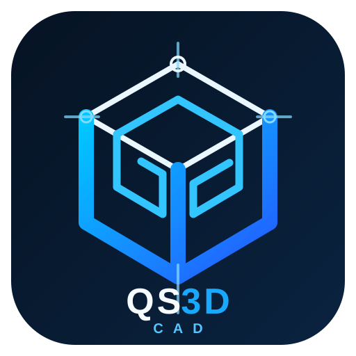

<p align="center"></p>

# QS3D CAD

Standalone Windows CAD/BIM/QS product. This repository is intentionally **not a BricsCAD plugin** and does not require `NETLOAD`, `BrxMgd.dll` or `TD_Mgd.dll`.

The current source implements a real standalone application/command/document boundary against the vendor-neutral `QS3D-Platform` contracts. It uses the Platform in-memory/reference adapter for deterministic development until a legally licensed production DWG/rendering SDK adapter is connected. Reference/in-memory success is **not DWG, renderer or native CAD qualification evidence**.

Read [`PLANNING.md`](PLANNING.md) first.

## Clone

The Platform dependency is pinned as an exact Git submodule commit:

```bash
git clone --recurse-submodules https://github.com/trinhtanphat/QS3D-CAD.git
cd QS3D-CAD
```

## Validate source + reference baseline

On Windows with the .NET 8 SDK:

```powershell
./scripts/validate.ps1
```

The validation script checks the exact Platform gitlink/checkout, standalone source boundaries, all pinned Platform source gates, then builds and runs deterministic Platform/CAD smoke suites when a usable SDK is available.

## Desktop workspace

```powershell
dotnet run --project src/QS3D.Cad.Desktop/QS3D.Cad.Desktop.csproj -c Release
```

The desktop File menu uses `*.qs3d` project packages. Save publishes through the validated previous-generation backup path; Open uses the recovery reader and reports when a validated `.qs3d.bak` was used. Raw `*.qs3d-bootstrap.json` remains an internal deterministic fixture format and is not the primary desktop project format.

The standalone desktop exposes an interactive **reference 2D viewport** over the deterministic CAD database: grid/axes, entity rendering, click selection, Line/Rectangle/Circle point picking, Erase/Move/Copy/Scale/Rotate/Mirror workflows, layers/current-layer controls, properties, command/messages panes, keyboard shortcuts, zoom-to-extents and a sample drawing action. Selection productivity includes Select All/Clear/Invert shortcuts, Select Same Type/Layer context actions and command-line history navigation. This is a usable host-neutral workspace, but it deliberately does **not** claim native DWG rendering until a licensed native viewport adapter is connected.

## Windows installer and releases

`VERSION` is the release version source. The Windows packaging lane publishes `QS3D.CAD` self-contained for `win-x64`, then builds an Inno Setup installer and SHA-256 sidecar:

```powershell
./scripts/package-windows.ps1
```

Expected outputs are:

- `artifacts/installer/QS3D-CAD-Setup-win-x64.exe`
- `artifacts/installer/QS3D-CAD-Setup-win-x64.exe.sha256`

The release workflow publishes those files as GitHub Release assets. Preview versions are marked as prereleases. The installer is self-contained, so end users do not need to install the .NET 8 desktop runtime separately.

The current preview installer is not Authenticode-signed because no production code-signing certificate is stored in this repository. Windows SmartScreen may therefore warn until a trusted signing certificate is configured in CI.

## Command surfaces

Drawing and document-journal commands include:

- `LINE x1 y1 x2 y2`
- `CIRCLE cx cy radius`
- `RECTANG x1 y1 x2 y2`
- `MOVE handle... dx dy`
- `COPY handle... dx dy`
- `SCALE handle... baseX baseY factor`
- `ROTATE handle... baseX baseY angleDegrees`
- `MIRROR handle... axisX1 axisY1 axisX2 axisY2`
- `SELECT handle...`
- `ERASE handle...`
- `LIST`
- `UNDO`, `REDO` — owned by the coordinated application journal, not the public command registry.

Selection/productivity surfaces include:

- `SELALL`
- `SELNONE`
- `SELINVERT`
- `SELKIND entityKind`
- `SELLAYER layerName`
- `SELPROP propertyKey propertyValue`
- `SELBOX Window|Crossing x1 y1 x2 y2`
- `DIST x1 y1 x2 y2`
- `MEASURE handle...`

`MEASURE` currently reports deterministic reference metrics for Line, Circle and the current rectangle-backed Polyline representation. Selection boxes operate on deterministic reference extents. These surfaces improve the standalone editor workflow but are **not** production-kernel/native-DWG qualification.

Common command aliases include `L`, `C`, `REC`, `M`, `CO`/`CP`, `SC`, `RO`, `MI`, `E`, `LA`, `B`, `I`, `ZE`, `ZW`, `U`, `RE`, `DI` and `ME`. Exact explicitly registered command names take precedence over fallback aliases so extension commands are not silently shadowed.

Desktop productivity shortcuts include `Ctrl+Shift+A` (Select All), `Ctrl+Shift+D` (Clear Selection), `Ctrl+Shift+I` (Invert Selection), plus the existing `Ctrl+Shift+S/R/M` transform shortcuts. In the command box, Up/Down navigates typed command history; an empty Enter recalls the most recent typed command so it can be repeated.

Layer/block surfaces include `LAYERS`, `LAYER ...`, `BLOCK`, `INSERT`, `BLOCKS`, `BLOCKDELETE`.

Semantic/QS surfaces include `QSTAG`, `QSLIST`, `QSHEALTH`, `QSCOUNT`, `QSFLOOR`, `QSZONE`, `QSPROP`, `QSLOC`, `QSQTY` and `QSSCHEDULE`.

`QSHEALTH` combines shared semantic/readiness diagnostics with standalone live-handle validation. A semantic source/generated reference whose handle disappeared from the active drawing reports `ORPHAN_HANDLE` and blocks readiness.

Reference-only navigation/document services include `VIEW`, `ZOOMEXTENTS`, `ZOOMWINDOW`, `HITTEST`, `SNAP`, `SELPOLY`, `XREFREF`, `LAYOUTREF`, `PLOTREF`. These are deterministic adapter behavior; `PLOTREF` records a plot request and deliberately does not claim to create a native PDF.

## Persistence

Current schema-v4 `*.qs3d-bootstrap.json` can persist reference CAD entities, semantic project state, stable IDs/CAD references, layers/current layer and block definitions. The loader remains backward-readable for earlier supported bootstrap schemas and normalizes corrupt/invalid content to `InvalidDataException` at the storage boundary.

The current `.qs3d` bootstrap/reference container is real ZIP file I/O with bounded reads, exact entry/manifest declarations, SHA-256 and declared-length validation, semantic/drawing media types, project identity checks, same-directory temporary publication, validated `.qs3d.bak` publication and fail-closed recovery.

The drawing payload is still the QS3D reference/bootstrap representation. The `.qs3d` container is therefore a real project-container foundation, but it is **not native DWG payload/fidelity evidence** and is not a substitute for the native SDK qualification lane.

## Native SDK boundary

`QS3D.Cad.Native.Oda.Bootstrap` only discovers external SDK configuration. It deliberately does not ship or impersonate ODA binaries. See [`docs/NATIVE-SDK-BOUNDARY.md`](docs/NATIVE-SDK-BOUNDARY.md) and [`docs/LOCAL-NATIVE-QUALIFICATION.md`](docs/LOCAL-NATIVE-QUALIFICATION.md).

No `BUILD_PASS`, `DWG_PASS`, `LOCAL_NATIVE_PASS` or `PRODUCTION_QUALIFIED` claim should be inferred from this README. Those require the exact source SHA to pass the corresponding build/native evidence gates.
